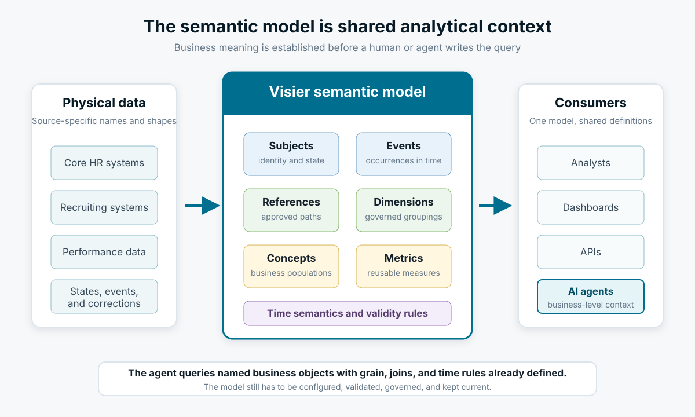
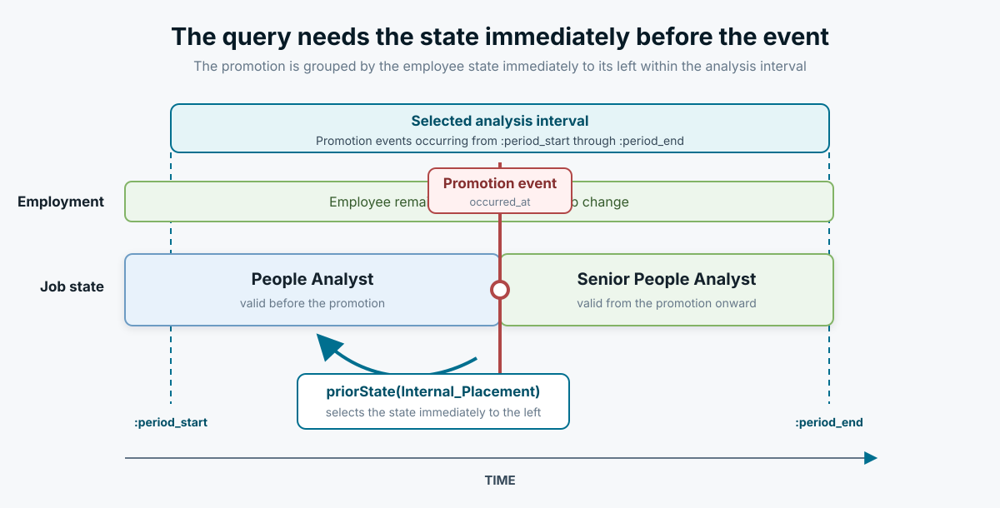

# Why Visier’s Semantic Model Makes Hard Analytics Easier for Humans and AI Agents

[Back to the Engineering Blog index](index.md) | [Visier Developer Docs](https://docs.visier.com/developer/developer.htm)

Consider a question that sounds simple:

> How many employees were active at any point during the quarter?

Answering it requires more than a count. The query has to encode the organization’s meaning of active employment, along with the relevant temporal boundaries and record grain.

Is an employee active when an `is_active` flag is true, when no exit event exists, or when an effective-dated record overlaps the quarter? Are validity intervals inclusive at both ends? If someone changes jobs twice during the quarter, should they be counted once or twice? If an exit is backdated later, which version of history should the query use?

Each choice comes from the analytic model.

An AI agent needs those choices too. Table definitions and column names provide the shape of the data and enough information to produce syntactically plausible SQL. The agent also needs context about which records represent subjects, which represent events, how relationships change over time, and which definition of “active employee” the organization has approved.

At Visier, we address that gap with a semantic model built around analytic objects, time, relationships, concepts, and metrics. The model serves human analysts and acts as a context layer for AI agents. It gives the agent a smaller, business-oriented vocabulary and keeps important decisions out of one-off query generation.

This article looks at three examples where that difference becomes concrete.

---

## From Physical Schema to Analytic Meaning

A warehouse schema describes the physical organization of data. It can tell us that `employee_state.employee_id` and `internal_placement_event.employee_id` share a name and compatible type. It cannot, by itself, tell us whether joining them is meaningful at the current state, at the event time, or immediately before the event.

For the SQL examples below, we will assume a deliberately small logical warehouse model:

- `employee_state(employee_id, valid_from, valid_to, is_active, job_name)`
- `internal_placement_event(placement_id, employee_id, occurred_at, is_promotion)`
- `requisition_state(requisition_id, valid_from, valid_to, is_open)`
- `applicant_state(applicant_id, requisition_id, valid_from, valid_to)`

Validity intervals are half-open: `[valid_from, valid_to)`. A null `valid_to` means that the state remains valid indefinitely, and state intervals for the same object are non-overlapping.

Those assumptions make the SQL examples precise and reviewable.

The same ideas appear in Visier as richer model objects:

| Warehouse term | Visier model object | What it contributes |
| --- | --- | --- |
| Effective-dated entity | Subject and member | Identity and state over time |
| Fact or transaction | Event and occurrence | Something that happened at an instant |
| Column | Property | A characteristic with analytic meaning |
| Foreign key or join | Reference | A named path between analytic objects |
| Repeated filter logic | Concept | A reusable business classification |
| Aggregate expression | Metric | A reusable measure with time and additivity semantics |

For agents, named objects such as `Employee`, `Internal_Placement`, `isPromotion`, and `isOpenRequisition` carry business meaning that would otherwise have to be inferred from a large physical schema.



*Figure 1: The semantic model is a shared context layer between physical data and every consumer, including AI agents.*

---

## 1. Employees Active at Any Time During a Period

Suppose the selected interval begins on April 1 and ends on July 1. We want to count each employee who was active at any point during that interval, including someone who exited in May.

With the logical schema above, the SQL is:

```sql
SELECT COUNT(DISTINCT employee_id) AS active_employee_count
FROM employee_state
WHERE is_active = 1
  AND valid_from < :period_end
  AND COALESCE(valid_to, '9999-12-31') > :period_start;
```

The two date predicates are an interval-overlap test. A period-end snapshot would omit employees who were active earlier in the quarter and then exited. The `DISTINCT` is also necessary because one employee may have several active states after changing job, location, or manager.

The corresponding Visier Formula Language (VFL) formula from Visier’s metric documentation is:

```text
on Employee
  lastKnownStateByFilterIn(!isActiveEmployee, interval)
  aggregate count(EmployeeID)
```

The time-handling function captures a business-level operation: find subjects that were valid at some point during the interval, including those that became inactive before it ended. The `isActiveEmployee` concept supplies the governed definition of active employment. (See more about [`lastKnownStateByFilterIn`](https://docs.visier.com/visier-people/Analytic%20Model/metrics/visier-formula-language.htm) in our documentation.)

A human SQL author might use `BETWEEN` and accidentally include both ends, filter on the current row, forget to deduplicate, or apply the wrong active flag. A generic agent can make the same mistakes. Unless its context explains the validity convention and the intended population, several different queries can look reasonable.

Active employment still requires a definition. VFL gives that definition a name and makes the temporal operation explicit. Once configured, the same definition can be used by a dashboard, API, analyst, or agent across many queries.

---

## 2. Promotions Grouped by the Employee’s Prior Role

Now consider a question that combines an event with subject history:

> How many promotions occurred during the period, grouped by the employee’s job immediately before the promotion?

This is different from grouping by the employee’s job at the end of the period. It is also different from grouping by the state that begins at the promotion instant. We need the state immediately before each event.

In SQL, one way to express that is:

```sql
SELECT
    prior_state.job_name AS prior_job_name,
    COUNT(*) AS promotion_event_count
FROM internal_placement_event AS promotion
JOIN employee_state AS prior_state
  ON prior_state.employee_id = promotion.employee_id
 AND prior_state.valid_from = (
        SELECT MAX(candidate.valid_from)
        FROM employee_state AS candidate
        WHERE candidate.employee_id = promotion.employee_id
          AND candidate.valid_from < promotion.occurred_at
    )
WHERE promotion.is_promotion = 1
  AND promotion.occurred_at >= :period_start
  AND promotion.occurred_at <  :period_end
GROUP BY prior_state.job_name;
```

The strict comparison in `candidate.valid_from < promotion.occurred_at` matters. If the promoted state starts at exactly the event time, using `<=` can select the new role when the analysis calls for the prior role.

Production SQL may need more rules: how to resolve tied effective dates, what to do when history has a gap, and whether late corrections can restate the event or the surrounding states. Those rules must be consistent wherever this analysis appears.

This metric calculation is expressed in the Visier Formula Language easily as:

```text
on priorState(Internal_Placement)
  filterBy(isPromotion)
  aggregate count(EmployeeID)
```

`priorState(Internal_Placement)` says directly which temporal context the metric uses, and we are looking at promotion event. Note that the metric formula itself does not contain a group-by, as the Job Name can be applied later as a dimension in an analysis. Because the metric is evaluated on the prior state, a group-by would use the employee’s job before each qualifying placement event.



*Figure 2: Event-relative analysis requires a deliberate choice of state. Here the requested context is the role immediately before the promotion.*

This is the kind of query where an agent can produce polished SQL that answers the wrong question. A column named `job_name` may exist in the event table, the current employee table, and an effective-dated history table. All three are joinable. This analysis calls for the history state immediately before the promotion.

The semantic model narrows that ambiguity. `Internal_Placement` identifies the event, `isPromotion` identifies the qualifying occurrences, and `priorState` identifies the required temporal relationship. The agent still has to choose the right metric; the model supplies the event-to-state behavior.

---

## 3. Open Requisitions with More Than Five Applicants

The third example crosses two subjects:

> At the selected instant, how many open requisitions have more than five applicants?

The SQL first reconstructs the valid applicant population, groups it through the applicant-to-requisition relationship, then reconstructs the valid requisition population:

```sql
WITH active_applicants_per_requisition AS (
    SELECT
        requisition_id,
        COUNT(DISTINCT applicant_id) AS applicant_count
    FROM applicant_state
    WHERE valid_from <= :as_of
      AND COALESCE(valid_to, '9999-12-31') > :as_of
    GROUP BY requisition_id
)
SELECT COUNT(DISTINCT requisition.requisition_id)
FROM requisition_state AS requisition
JOIN active_applicants_per_requisition AS applicants
  ON applicants.requisition_id = requisition.requisition_id
WHERE requisition.is_open = 1
  AND requisition.valid_from <= :as_of
  AND COALESCE(requisition.valid_to, '9999-12-31') > :as_of
  AND applicants.applicant_count > 5;
```

This SQL assumes that `applicant_state` records an applicant’s association with a requisition over time. The validity predicates select the association in effect at `:as_of`, so each applicant is counted for the requisition they were associated with at that instant. If applications are stored as point-in-time events instead, the query would need a different structure.

The same calculation appears in VFL using a named reference:

```text
NumberOfApplicantsForRequisition :=
  property(
    on Applicant
      via Requisition
      validUntil instant
      aggregate count(Applicant.ApplicantID)
  )

on Requisition
  filterBy(
    NumberOfApplicantsForRequisition > 5
    && isOpenRequisition
  )
  aggregate count(RequisitionID)
```

The nested query calculates an applicant count for each requisition through the configured `Requisition` reference. The outer query applies the `isOpenRequisition` concept and counts the qualifying requisitions.

For an agent working directly from a physical schema, the query requires several pieces of context: which applicant row is valid at `:as_of`; whether an applicant’s requisition assignment can change over time; what open requisition means; and whether the final count is of rows, applicants, or requisitions. Column names can only provide some hint at those choices but it's very easy to get them wrong.

The semantic model approach Visier takes, on the other hand, provides an abstraction over the underlying database schema. `via Requisition` identifies an approved navigation path. `validUntil instant` establishes the temporal context. `isOpenRequisition` gives the population a stable business name.

---

## Why This Model Is Context for an AI Agent

When people discuss context for an AI agent, the focus is often on how much text can be placed in a prompt. For analytical work, the more important question is what kind of context the agent receives.

A dump of database metadata can be large while still omitting the decisions that determine correctness. It may describe hundreds of tables, columns, and foreign keys without answering:

- Which object is the authoritative representation of an employee?
- Is a row a current state, a historical state, or an event?
- Which end-date convention is in use?
- Which relationship should be followed when several join paths exist?
- Is a metric additive across organizations, across time, both, or neither?
- Which filter implements the approved definition of an active employee?

The semantic model supplies those decisions in a form an agent can discover and use. Subjects and events establish the important entities to pay attention to. References define relationship among the entities. Concepts name reusable populations. Dimensions provide standardized group-bys. Metrics define meaningful aggregation and additivity. Time-handling functions state whether the calculation uses an instant, an interval, or a state relative to an event.

That is why we describe the semantic model as a context layer. It translates physical data into the vocabulary of the business question before the question reaches the query engine.

There are practical consequences for agent design.

The available query surface also becomes smaller. An agent can choose among governed metrics and dimensions, avoiding an open-ended search across every column and possible join in the warehouse. Less context is required, and the remaining context carries more meaning.

A useful agent workflow therefore begins with model discovery. Query generation follows after the agent identifies the analytic object, finds an existing metric or concept, checks the available dimensions and references, and establishes the requested time context. The metadata guides and constrains the analytical choices the agent can make; pasting table definitions into a prompt leaves those choices open.

For example, a request for employees active during the quarter by organization can resolve to four model decisions: the `Employee` subject, the active-during-period metric, the Organization dimension, and a quarterly interval. Those selections describe the intended population, grouping, and time behavior before any query text is produced. They also give a reviewer a compact record of how the agent interpreted the request.

The definitions are shared. If an analyst, dashboard, API integration, and agent all use the same Headcount metric, one model change updates their common definition.

This also makes context maintainable. A prompt that says “use our standard headcount definition” becomes useful when the agent can resolve that phrase to an actual model object. When the definition changes, the model can change with it. The agent continues to reference the same object and avoids stale explanations embedded in prompts, example queries, or retrieval documents.

SQL has a practical inspection advantage: it is broadly understood by human analysts and coding agents, and mature database tools can expose execution plans, intermediate results, and row-level samples. VFL and the semantic model offer a complementary kind of inspectability. A request using `priorState(Internal_Placement)` exposes its temporal intent without requiring a reviewer to reconstruct that intent from window functions, joins, and boundary predicates.

Visier also provides tools for testing each layer of the result. In Studio, authors can [validate a metric formula and preview its values](https://docs.visier.com/developer/Analytic%20Model/metrics/metrics-create.htm), then use the metric’s Dependencies tab to trace and preview the concepts, properties, and other objects that feed it. In an analysis, [Detailed View can reveal the contributing records](https://docs.visier.com/developer/Studio/data/validation/troubleshoot-data-issues.htm); when an unexpected value originates in data loading or transformation, the [Debug Inspector](https://docs.visier.com/developer/Studio/data/validation/debug-inspector.htm) follows an individual record through the event stream. These tools make the standard metric formula, its inputs, and its record-level behavior inspectable.

The model creates a useful boundary for governance. Agents still require appropriate access, and generated analyses still require validation. Business definitions and permitted relationships remain in the model, where each task can reference them directly.

For more background on the architecture behind this model, see our three-part series on [subject- and time-centric modeling](Feb-01-2026-Part-1-why-analytics-breaks-under-change.md), [event streams and temporal analytics](May-01-2026-Part-2-inside-visier-db-event-streams-temporal-queries-metrics-cohorts.md), and [the engineering practices used to maintain Visier DB](May-24-2026-Part-3-building-and-maintaining-visier-db-one-cached-copy-security-engineering-discipline.md).

The VFL examples in this article are adapted from the official [Metric Formula Examples](https://docs.visier.com/developer/Default.htm#cshid=1079).

Return to the [Engineering Blog index](index.md) for the latest posts.
