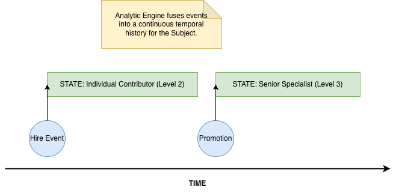
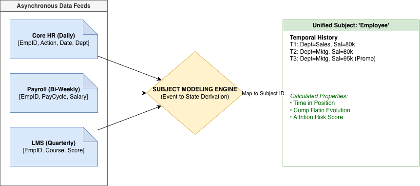
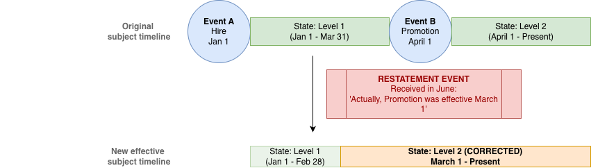

# Why Analytics Breaks Under Change (and How Visier’s Subject Model Helps)

Visier has achieved significant financial success, but this series is not about the business story. It’s about the **technical decisions** that make Visier different—especially how we handle **constant change** in real‑world data.

Modern organizations live in a state of flux:

- Entities change: people get hired, promoted, transferred, and leave.
- Schemas change: new fields appear, systems are replaced, semantics evolve.
- Sources change: new systems are onboarded; others are deprecated.
- Cadence changes: some data arrives daily, some weekly, some quarterly.

Most traditional BI/ETL stacks were not built for this reality. They typically:

- Aim at a **point‑in‑time “current state”** of the data.
- Hard‑wire business logic directly into ETL and SQL.
- Require **consultant‑driven customization** every time something changes.

Visier was founded with a different goal:

> Deliver analytics as a **flat‑rate product**, not as an open‑ended consulting engagement, by building technology that **absorbs the cost of change**.

To get there, we made some foundational choices: a **subject‑ and time‑centric data model**, an **event‑driven ingestion layer**, and a **temporal, object‑based analytics engine**. In this first part, we’ll focus on the **data model**.

---

## A Subject‑ and Time‑Centric Data Model

Visier’s data model revolves around **subjects**.

### Subjects: Real‑World Entities, Not Rows

A **subject** is a real‑world entity you want to analyze:

- Employees
- Positions
- Sales opportunities
- Job applicants
- …or any other business object

Each subject has:

- **Properties** (e.g., job level, salary, location).
- **Relationships** (e.g., employee → manager, person → position).
- A **life over time**.

Instead of designing around tables and rows from each source system, we think in terms of:

> “What is this **subject**? What are the **properties** we care about? How do they evolve over time?”

*Figure 1: The subject-centric view—real-world entities with properties and relationships, modeled over time.*

### Time as a First‑Class Dimension

Every subject has a **time aspect**:

- It exists from a **start date** to an **end date**.
- Within that lifespan it passes through multiple **states**:
  - Hiring,
  - Promotions,
  - Compensation changes,
  - Location moves,
  - Performance events,
  - Training, etc.

Each of these changes corresponds to an **event**. Those events are modeled by the data we load into the system.

Crucially:

- Different sources can be loaded on **different schedules**:
  - HR data daily or multiple times per day,
  - Performance data quarterly,
  - Sales data weekly, and so on.
- The engine’s job is to fuse these feeds into a **coherent temporal history** per subject.

---

## Why Traditional ETL Struggles Here

Consider an organization with multiple systems—a very common situation. There are often **multiple core HR systems** (e.g., different systems by region, or legacy and new HR coexisting), not only systems covering different domains:

- Core HR system(s) for demographics and job data (often more than one).
- Performance system for reviews.
- ATS for recruiting events.
- Payroll and compensation systems.

A typical ETL‑centric approach:

1. Extracts rows from each system.
2. Joins them into a warehouse schema.
3. Keeps a mostly **current‑state** view, with maybe some slowly changing dimensions.

The problems:

- **Different temporal resolutions** are hard to align:
  - Location updated monthly,
  - Performance ratings quarterly,
  - Comp changes as‑of effective dates.
- **History** is incomplete or bolted on:
  - Often limited to “current” plus a few snapshots.
- **Schema evolution** is painful:
  - Every new or changed column requires updating chains of SQL and ETL jobs.
- **Business rules** (e.g., “last promotion date”) get scattered across:
  - ETL scripts,
  - Reports,
  - Dashboards,
  - Ad‑hoc queries.

*Figure 2: Why traditional ETL struggles—multiple sources, different cadences, and current-state focus lead to fragile pipelines.*

The result: high maintenance cost and fragile analytics whenever the real world changes.

---

## From Rows to States and Events

Visier takes a different approach:

- We treat incoming data as **events that change the state of a subject**, not just rows populating tables.
- We care less about the specific source schema and more about:
  - **Which subject** a record belongs to, and
  - **Which property** of that subject it affects.

This leads to a few key principles:

1. **Schema‑agnostic mapping**  
   - We identify data in source files and **map it to properties on analytic subjects**.
   - Concepts like “row from table X” matter less than:
     - “This field sets `employee.location` from date D,” or
     - “This sets `employee.placement_type` and thus might affect promotion logic.”

2. **Events → States**  
   - We record events (hiring, transfers, salary changes) and derive **states over time**:
     - e.g., “Employee was at Job Level 3 from 2022‑01‑01 to 2023‑03‑10, then Job Level 4.”

3. **Handling corrections and restatements**  
   - If a source system corrects an earlier record, we can:
     - Ingest the correction as another event,
     - Re‑derive the subject’s history accordingly.

4. **Decoupling from source schemas**  
   - Business rules are defined in terms of **subject properties**, not specific source columns.
   - When schema changes, you don’t have to rewrite every SELECT/INSERT in the pipeline.

*Figure 3: From rows to states and events—schema-agnostic mapping keeps business rules independent of source structure.*

---

## Business Rules Without Schema Lock‑In

A concrete example:

> “Set `employee.last_promotion_date` when the placement type changes from A to B.”

In many ETL setups, that logic is embedded in SQL tied to table and column names. If the schema changes, someone has to update the SQL everywhere that logic appears.

In our approach:

- The rule is expressed as:
  - “When this **analytic property** changes in a certain way, set another property.”
- This is **independent of how the source system labels its columns** or how the feed is structured.
- You can change source schemas, add new sources, or restate history without needing to:
  - Rewrite long ETL chains,
  - Retrofitting every downstream transformation.

---

## Where This Series Goes Next

This first part described:

- The **problem space**: analytics under constant change.
- Visier’s **subject‑ and time‑centric** data model.
- Why traditional row‑centric ETL struggles with multi‑source, time‑varying data.
- How modeling **states and events** decouples analytics from brittle source schemas.

In **Part 2**, we’ll dig into:

- The **Event Stream Loader (ESL)**: how we implement this state/event approach in practice.
- **Visier DB**: a temporal, in‑memory, object‑based engine designed for rich analytics over time.
