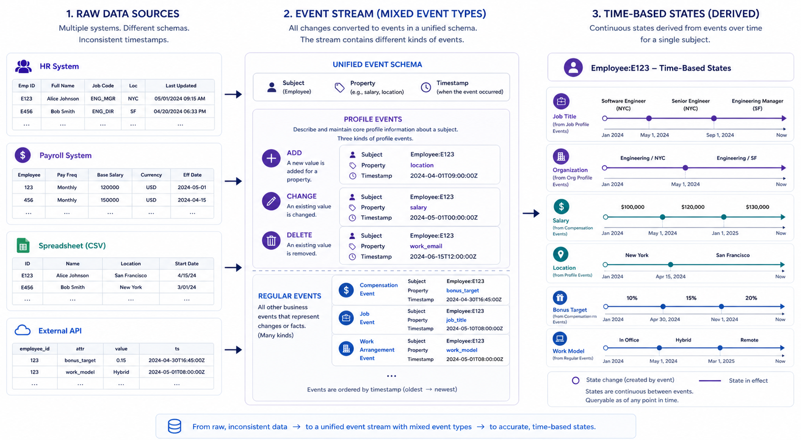
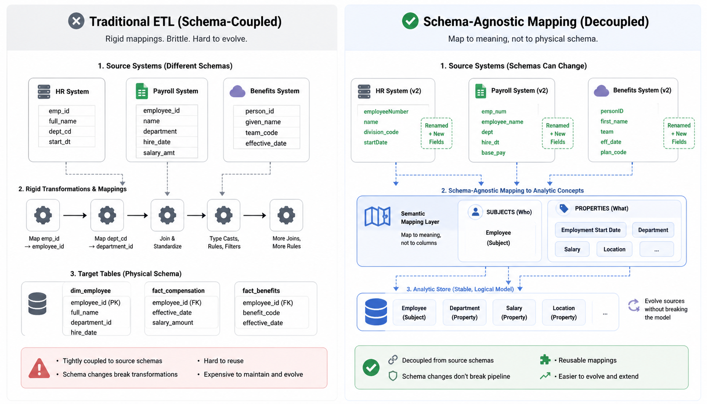
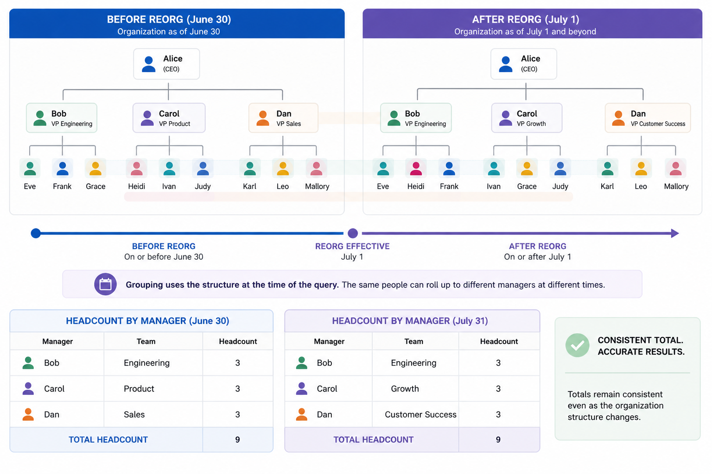

# Inside Visier DB: Event Streams, Temporal Queries, Metrics, and Cohorts

[Back to the Engineering Blog index](index.md) | [Visier Developer Docs](https://docs.visier.com/developer/developer.htm)

In [Part 1](Feb-01-2026-Part-1-why-analytics-breaks-under-change.md) we looked at Visier's subject- and time-centric data model and why traditional ETL pipelines struggle with constant change.

In this part, we'll focus on:

- How we ingest data as **states and events** using the Event Stream Loader.
- How **Visier DB**, a temporal, in-memory, object-based engine, executes analytics.
- How we model **metrics** and **cohorts** as first-class concepts.

---

## From Data Feeds to Event Streams: The Event Stream Loader

Real systems change constantly:

- New systems are added; old ones are retired.
- Data arrives at different cadences and granularities.
- History is sometimes restated or corrected.

Our ingestion layer is designed to embrace this reality rather than fight it.

### Modeling as States and Events

Instead of stitching together rows from multiple systems into a static table, we:

1. Interpret each incoming record as an **event** that affects:
   - A specific **subject** (e.g., an employee).
   - A specific **property** of that subject (e.g., `salary`, `location`).

2. Maintain a derived history of **states**:
   - For each subject, we track how its properties change over time.

This event/state model makes it much easier to:

- Combine data with different temporal resolutions (monthly, quarterly, effective-dated).
- Handle delayed arrivals and historical corrections.
- Keep a coherent, analytic view of the world as of any date.

*Figure 1: The Event Stream Loader turns heterogeneous source data into a unified event stream, then derives time-based subject states.*

### Schema-Agnostic Transformations

A key design choice is to be **schema agnostic**:

- We don't bake into code:
  - "Column A in file X becomes column B in table Y."
- Instead, we express:
  - "This field in this feed maps to this **analytic property** of this **subject**."

Benefits:

- **Corrections and restatements** can be applied without rebuilding the pipeline.
- **Schema changes in sources** (e.g., renaming or adding columns) don't require:
  - Rewriting every transformation step,
  - Updating long chains of SELECT/INSERT statements.

Business rules are written in terms of **analytic meaning**, not physical schema.

*Figure 2: Schema-agnostic mapping decouples analytic meaning from brittle source schemas.*

---

## Visier DB: A Temporal, Object-Based Engine

Once data is modeled as time-varying subjects, we need a query engine that understands:

- Time,
- States,
- Groupings and hierarchies that change over time.

That's what **Visier DB** is designed for.

### Object-Based, Not Row-Based

Visier DB is a **temporal, in-memory, object-based engine**:

- The fundamental query unit is the **state of an object (subject)**, not a raw row.
- Example query:
  - "Give me the state of employee X as of 2023-06-30."
  - Or: "Count all employees, grouped by their manager as of each month-end this year."

The engine is:

- **Purpose-built for analytics and aggregations**.
- Explicitly **not** a transactional system.

### Handling Organizational Restructures and Movements

Real analytics problems often involve complex temporal behavior:

- **Org restructures**:
  - Reporting lines change.
  - Business units are split or merged.
  - Yet, you still need "the sum of the parts to equal the total" historically.

- **Personnel movements**:
  - Employees join, exit, or move between teams.
  - Security scopes or cost centers shift over time.

Visier DB treats every dimension used for grouping as **time-aware**:

- Grouping by `manager` means:
  - "Manager at that time," not "current manager today."
- Grouping by `organization` means:
  - "Org membership as of the query's time context."

This allows us to answer questions like:

- "What was headcount by department **before** the big reorg last year?"
- "How did exits vary across managers, using the reporting structure at the time of each exit?"

*Figure 3: Time-aware grouping lets the same people roll up through the correct structure for each query date.*

### Time-Dependent Grouping and Filtering

Time is not just a filter; it becomes an ingredient in metrics and groupings.

For example, consider **"time since promotion"**:

- Defined once as a derived property of a subject's history.
- Then you can:
  - Filter employees by time since last promotion,
  - Group exit rates by that time bucket,
  - Reuse that logic across multiple analyses.

Visier DB supports **time-dependent grouping and filtering** directly, so these kinds of questions are natural rather than custom one-off SQL gymnastics.

---

## Metrics as Time-Aware Functions

Analytics isn't just about counting rows; it's about measuring **behavior over time**.

Examples of the kinds of metrics Visier supports:

- **State as of a point in time**
  - "Headcount as of 2023-12-31."
- **Ever-held conditions**
  - "How many people held Role R at any point during March 2023?"
- **Prior state to an event**
  - "What was an employee's state immediately before they quit?"
  - "What did a candidate's profile look like right before their application was rejected?"

These metrics require the engine to:

- Traverse a subject's state history,
- Find the state immediately prior to an event,
- Or find all states within a defined time window.

While you can do this in SQL with careful effective-dated modeling, it quickly becomes:

- Complex,
- Hard to maintain,
- Easy to get subtly wrong.

Visier DB's temporal model makes these patterns first-class and reusable.

---

## Cohorts: Time-Locked Filters

A **cohort** in Visier is a **time-locked filter** over subjects.

Conceptually:

- Define a set of subjects based on conditions **at a particular time**,
- Then track that set's behavior **over subsequent time**.

### Example 1: Hire Cohorts and Survival Curves

- Cohort: "Employees who started in January 2023."
- Analysis: "How many of them are still with us at each month-end after their start date?"

This yields a **survival curve**:

- X-axis: time since hire,
- Y-axis: number (or percentage) of the cohort remaining.

### Example 2: Training Impact

- Cohort: "Employees who took training X in Q1."
- Analysis:
  - "What happened to their sales performance over the six months after the training?"
  - "How did this compare to a matched non-participant cohort?"

These use cases rely on cohorts being:

- **First-class objects in the database**, not just ad-hoc WHERE clauses.
- Defined once, reused across multiple analyses and metrics.

---

## Where This Series Goes Next

So far, we've covered:

- How ingestion is modeled as **states and events**.
- How **Visier DB** supports temporal, object-based analytics.
- How **metrics** and **cohorts** are represented as time-aware, reusable concepts.

In **Part 3**, we'll move beyond the data model and engine internals to look at:

- Our **one cached copy architecture and security model**.
- The role of **test automation and code quality** in evolving the engine safely.
- How we think about **third-party libraries vs. building in-house** for critical components.

Return to the [Engineering Blog index](index.md) for the latest posts.
