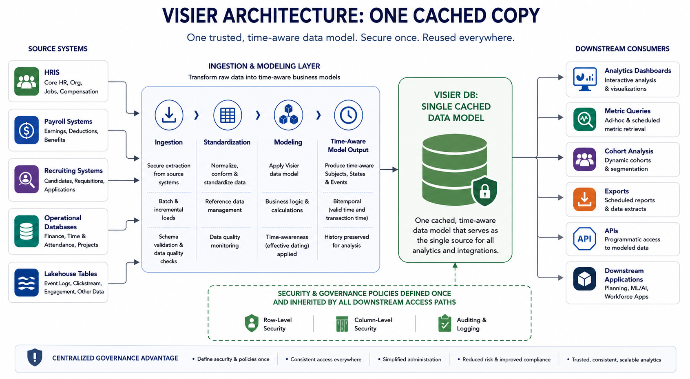
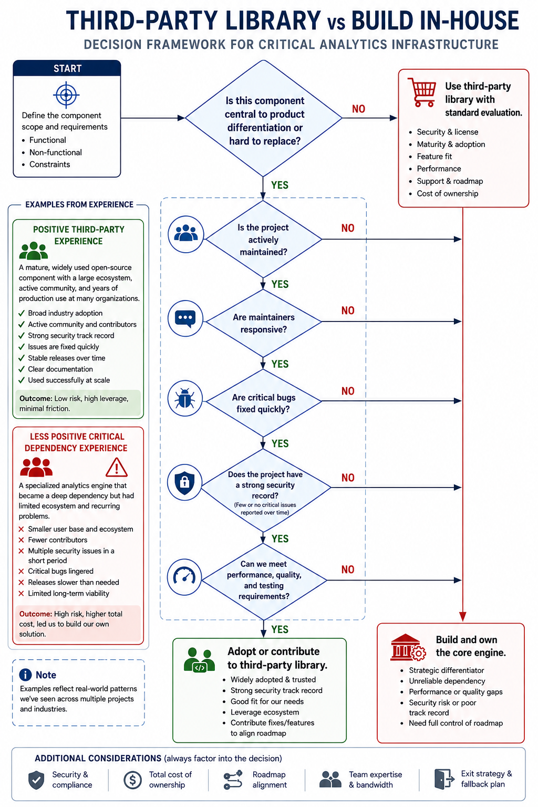

# Building and Maintaining Visier DB: One Cached Copy, Security, and Engineering Discipline

[Back to the Engineering Blog index](index.md) | [Visier Developer Docs](https://docs.visier.com/developer/developer.htm)

In [Part 1](Feb-01-2026-Part-1-why-analytics-breaks-under-change.md), we explored Visier's subject- and time-centric data model.
In [Part 2](May-01-2026-Part-2-inside-visier-db-event-streams-temporal-queries-metrics-cohorts.md), we looked at the Event Stream Loader, Visier DB's temporal engine, and how we model metrics and cohorts.

In this final part, we'll focus on three areas that make the system sustainable over time:

- The **one cached copy architecture** and its impact on security and governance.
- Our emphasis on **test automation** and **code quality**.
- How we decide between **third-party libraries** and **building in-house**.

---

## One Cached Copy Architecture and Security

Visier's analytics architecture is built around a **managed cached copy** of source data.

Source systems remain the systems of record. Visier ingests from those systems, applies the analytic model, and maintains a cache that is optimized for time-aware analytics. The goal is to give customers consistent analytics while preserving a clear boundary between source data and Visier's analytic representation.

At a high level, we:

- Ingest source data.
- Model it as time-aware subjects, states, and events.
- Maintain Visier's analytic representation as a **managed cached copy** of the source systems.

### One Cache Boundary, Multiple Internal Representations

When we say **one cached copy**, we do not mean there is literally only one physical file, table, or internal representation of data inside Visier. The system may store data in different formats for different operational reasons, such as flat files, derived views, or index-like structures used for query performance.

The important boundary is architectural: Visier as a whole behaves like one managed cached copy of the source data. Internal representations are implementation details inside that cache. They are not separate downstream sources of truth with their own business semantics, security definitions, or governance lifecycle.

That cache has two important properties:

- It can be **deleted as a whole** when, for example, a tenant is deprovisioned.
- It can be **invalidated, updated, and reloaded** from the source systems when the source data changes or needs to be corrected.

All analytics, exports, and downstream experiences operate over this managed cached copy.

*Figure 1: Visier's one cached copy architecture treats Visier's analytic data layer as a managed cache boundary, while supporting multiple downstream consumers.*

### Why One Cached Copy?

The one cached copy approach has several advantages.

1. **Consistent semantics**
   - There is a single, canonical semantic model for each subject and its history.
   - Business logic, such as promotion rules and cohort definitions, is defined **once** at the model level.

2. **Security applied consistently**
   - Row- and column-level security policies are expressed over the modeled data.
   - Any view or export that runs against Visier DB inherits those rules.

3. **Clear cache lifecycle**
   - Internal performance structures can be recreated because they are part of the cache, not independent records of truth.
   - When data must be removed, invalidated, or reloaded, the system can reason about the cache as one managed boundary.

4. **Reduced governance complexity**
   - In "many-copy" models, each derived dataset or cube may need its own policy configuration and lifecycle.
   - In Visier's one cached copy model, the modeled analytic layer is governed consistently regardless of how the data is accessed.

This does not mean the one cached copy architecture is the only mechanism for data governance. Other controls, such as bring your own key (BYOK) and same-jurisdiction storage, address complementary governance and compliance requirements. The cache-copy model is specifically about preserving source-of-truth semantics, avoiding unmanaged analytic copies, and making cache deletion and refresh a first-class part of the architecture.

---

## Test Automation and Code Quality

The technical decisions we've described -- temporal modeling, event streams, and one cached copy architecture -- introduce significant complexity. To evolve such a system safely, we depend heavily on **test automation** and disciplined **code review**.

### Heavyweight Test Automation from the Start

From the early days:

- The core engine was accompanied by on the order of **100k automated test cases**.
- Today, of the many automated test cases, there are roughly **40,000-50,000 tests** focused on just the **core aggregation logic** alone.

These tests have several important characteristics.

### Table-In / Result-Out

Tests are often structured around specific input tables and expected analytic results:

- Given specific input tables, such as facts, dimensions, and events,
- Verify that aggregate results match the expected output exactly.

This style keeps tests close to the behavior users depend on, rather than only checking internal implementation details.

### Business-Meaningful Tests

Good tests encode clear business requirements. They should be understandable and verifiable by humans, not just snapshots of internal engine behavior. For an analytics engine, that means tests should make it clear what business question is being asked and what answer is expected:

- "What is headcount as of this date?"
- "Which employees are visible to this user under this security scope?"
- "How does this metric behave when source data is corrected or restated?"

That framing matters because the engine's internals can change over time, but the business contract must remain stable.

### A Tiered Test Strategy

We use different test tiers for different kinds of risk.

At the lowest level, **unit tests** cover core parts of the engine logic. These focus on business requirements such as:

- Data correctness for aggregation, filtering, grouping, and temporal calculations.
- Security behavior, including row- and column-level access rules.
- Edge cases around time, corrections, restatements, and missing data.

At the next level, **integration tests** verify how the core engine logic works with the rest of the platform. These tests cover interactions such as:

- Authentication and authorization.
- Versioning of models, data, and metadata.
- Integration with underlying storage systems.
- Interactions between ingestion, modeling, query execution, and security enforcement.

At the highest level, **end-to-end tests** cover API endpoints and UI components working together. These tests run in two important contexts:

- **Virtualized environments**, where we can exercise realistic platform behavior quickly and repeatedly.
- **Real deployments**, where we verify that the full stack behaves correctly under production-like conditions.

In addition to these functional tiers, we also test non-functional aspects of the system, including:

- **Performance**, so changes to the engine do not quietly degrade query latency, throughput, or scalability.
- **Security**, so access control behavior remains correct as the platform evolves.

This level of coverage means:

- Developers can change core engine code with higher confidence.
- The risk of silently breaking critical analytics is reduced.
- Regression bugs are often caught **before** they leave development.

---

## Third-Party Libraries vs. Building In-House

Finally, a word about dependencies. Visier uses open-source and third-party libraries, but cautiously, especially for components in the **critical path**.

### What We Look For in Third-Party Libraries

Key considerations include:

- **Quality and stability** of the implementation.
- **Responsiveness of maintainers**:
  - Do they accept bug reports?
  - Are patches reviewed and merged promptly?
- **Long-term sustainability**:
  - Is the project actively maintained?
  - Is there a healthy contributor community?

*Figure 2: For critical analytics infrastructure, the build-vs.-buy decision depends on strategic importance, maintainability, responsiveness, quality, and control.*

In one positive third-party library experience, we saw:

- Good responsiveness.
- Bug fixes and improvements accepted quickly.
- A collaborative relationship.

In a historical example from the other direction, roughly a decade ago, we had a critical third-party OLAP dependency that no longer fit our requirements. This is not meant as a current assessment of any specific project or maintainer group. At the time, for the specific critical-path use case we had, we found:

- We did not have enough control over the roadmap and release cadence.
- Some issues important to our use case were not resolved quickly enough for a core platform dependency.
- The gap between our requirements and the available engine behavior was growing.

### When We Decided to Build Our Own Engine

That historical experience with a critical third-party OLAP engine eventually led to a pivotal decision:

- **Build our own in-house OLAP/analytics engine**.
- Design it specifically around:
  - Temporal, subject-centric analytics.
  - Our testing and quality expectations.
  - Our performance and scalability goals.

This shift:

- Removed a major external dependency from the critical path.
- Allowed us to iterate and optimize the engine as needed.
- Tightened the alignment between our business requirements and our core technical capabilities.

The broader lesson:

> For components that are **central to your differentiation** and hard to swap out, relying on a dependency whose roadmap, release cadence, or design goals no longer match your requirements is risky. Owning that technology can be the better long-term choice.

---

## Closing Thoughts

Across this three-part series, we've covered:

1. **[Why analytics breaks under change](Feb-01-2026-Part-1-why-analytics-breaks-under-change.md)**, and how a **subject- and time-centric model** helps.
2. How **[event-driven ingestion and a temporal, object-based engine](May-01-2026-Part-2-inside-visier-db-event-streams-temporal-queries-metrics-cohorts.md)** (Visier DB) support rich metrics and cohorts.
3. How a **one cached copy architecture**, strong **test automation**, and careful decisions about **third-party dependencies** make the system sustainable over time.

Taken together, these decisions allow Visier to:

- Handle constant change in data, schemas, and business rules.
- Provide consistent, time-aware analytics.
- Evolve the platform without sacrificing correctness or governance.

If you'd like a deeper dive into areas such as the internal representation of cohorts, the details of our temporal join algorithms, or specifics of our security model, those would be natural next steps for a future article.

Return to the [Engineering Blog index](index.md) for the latest posts.
