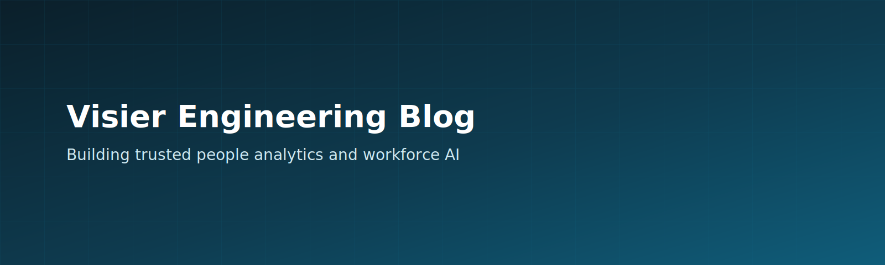

# Visier Engineering Blog

Welcome to the Visier Engineering Blog. We will share how we build, operate, and evolve the technology behind Visier.

## About Visier

Visier is a people analytics company focused on AI-powered workforce insights. Its platform helps organizations bring people and work data together to deliver workforce intelligence and support better decisions across the employee lifecycle. Visier was founded in 2010 and is headquartered in Vancouver, British Columbia, with offices and team members worldwide.

## What to expect here

This is a placeholder page for now. Upcoming posts will cover:

- Architecture and platform engineering
- Data modeling and analytics at scale
- AI and ML in people insights
- Security, privacy, and compliance
- Engineering culture and career growth at Visier

If you are looking for product information or company news, visit Visier's public website.
